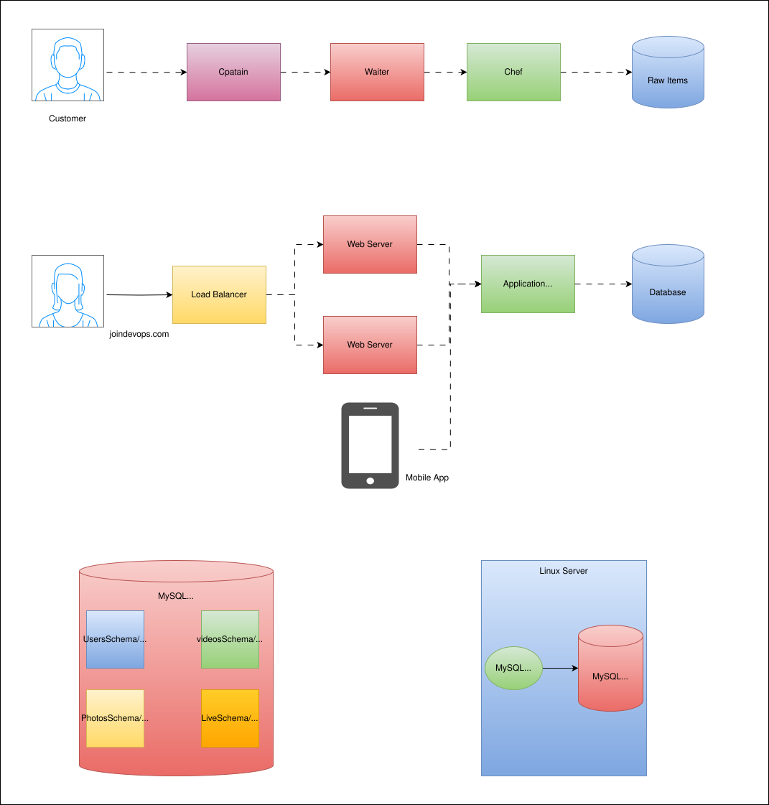

# Expense Documentation - 3 Tier Architecture

## Overview

This project demonstrates a classic **3-Tier Architecture** used in modern web applications.

The architecture separates the application into three layers:

1. Presentation Layer (Web Tier)
2. Application Layer (Business Logic Tier)
3. Data Layer (Database Tier)

This separation improves scalability, maintainability, security, and performance.

---

## Real World Example

Think of a restaurant:

Customer → Captain → Waiter → Chef → Raw Items

- Customer places an order.
- Captain receives the order.
- Waiter delivers the order to the chef.
- Chef prepares food using raw ingredients.

Similarly, in software architecture:

User → Load Balancer → Web Server → Application Server → Database

Each component has a specific responsibility.

---

## Architecture Diagram



---

## Request Flow

```text
User
  │
  ▼
Load Balancer
  │
  ├──► Web Server 1
  │
  └──► Web Server 2
          │
          ▼
    Application Server
          │
          ▼
       Database
```

---

## Components

### 1. User

The end user accesses the application through a browser or mobile device.

Example:

```text
https://surendevops75.com
```

---

### 2. Load Balancer

The Load Balancer distributes incoming traffic across multiple web servers.

Benefits:

- High Availability
- Fault Tolerance
- Better Performance
- Traffic Distribution

Examples:

- AWS Application Load Balancer (ALB)
- NGINX
- HAProxy

---

### 3. Web Servers (Presentation Layer)

The web servers handle:

- Static content
- HTML
- CSS
- JavaScript
- User requests

Examples:

- NGINX
- Apache HTTP Server

Multiple web servers can be deployed for scalability.

---

### 4. Application Server (Business Layer)

The application server contains business logic.

Responsibilities:

- Process user requests
- Execute business rules
- Communicate with the database
- Return responses to users

Examples:

- Java Spring Boot
- Node.js
- Python Django
- .NET Core

---

### 5. Database (Data Layer)

Stores application data permanently.

Responsibilities:

- Data Storage
- Data Retrieval
- Data Consistency

Examples:

- MySQL
- PostgreSQL
- Oracle
- MongoDB

---

## Advantages of 3-Tier Architecture

### Scalability

Each tier can be scaled independently.

### Security

Database is not exposed directly to users.

### High Availability

Multiple web servers can handle failures.

### Maintainability

Changes in one layer have minimal impact on others.

### Performance

Load balancing improves response times.

---

## Example Request Journey

1. User visits `joindevops.com`
2. Request reaches Load Balancer.
3. Load Balancer forwards request to an available Web Server.
4. Web Server sends request to Application Server.
5. Application Server queries Database.
6. Database returns data.
7. Response flows back to the user.

```text
User
 ↓
Load Balancer
 ↓
Web Server
 ↓
Application Server
 ↓
Database
```

---

## Technologies Used

| Layer | Technologies |
|---------|-------------|
| Load Balancer | AWS ALB, NGINX, HAProxy |
| Web Layer | NGINX, Apache |
| Application Layer | Java, Python, Node.js, .NET |
| Database Layer | MySQL, PostgreSQL, MongoDB |

---

## Conclusion

The 3-Tier Architecture is one of the most widely used architectural patterns in enterprise applications. By separating presentation, business logic, and data storage into distinct layers, organizations can build scalable, secure, and highly available applications.